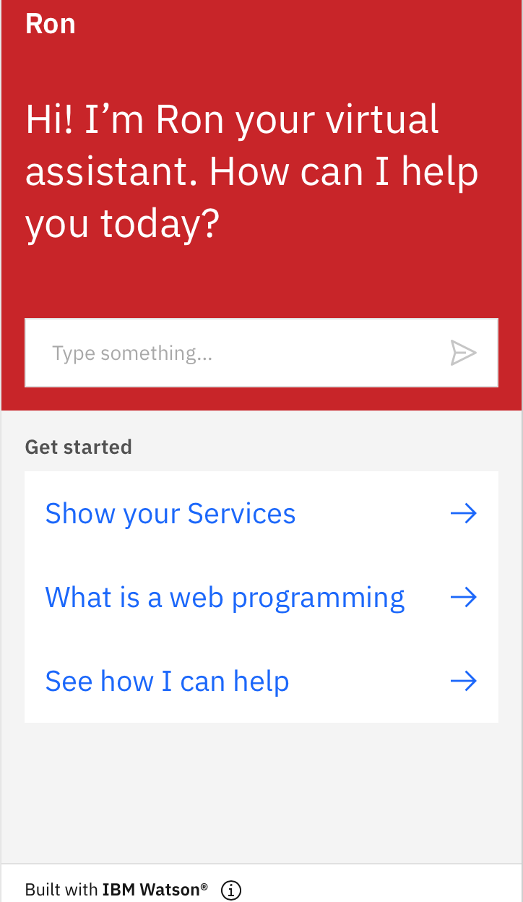

# Task3-Chatbot
This task is a part of the summer training at the Smart Methods Company.
---------------------
This task is to create a chatbot by IBM Watson Assistant for the (Evaluation robot from Smart Methods company).
----
We were given the freedom to choose topics to create a chatbot, not a requirement for an (Evaluation robot), so I chose to create a chatbot for simple web programming.
I integrated the chatbot with the HTML page that contains Control panels from task 2.

--------------------------------
The Chatbot home interface
------------------------------

-------------------------------
Helpful sources to learn
---------------------------
1. https://cloud.ibm.com/docs/assistant 
2. https://watson-assistant-demo.ng.bluemix.net/?_ga=2.46491687.1608756696.1624896492-1926695582.1624896492
3. https://www.youtube.com/watch?v=hitUOFNne14&t=1695s 
4. https://github.com/shaimadotcom/ibm_watson_assistant.git  

-----------------------
هذه المهمة هي جزء من التدريب الصيفي في شركة الأساليب الذكية
---------------------
هذه المهمة هي إنشاء chatbot بواسطة IBM Watson Assistant لـ (روبوت التقييم من شركة الأساليب الذكية).
----
لقد تم منحنا حرية اختيار الموضوعات لإنشاء روبوت محادثة ، وليس شرطًا لـ (روبوت التقييم) ،
لذلك اخترت إنشاء روبوت محادثة بسيطة لبرمجة ويب .
 قمت بدمج chatbot مع صفحة HTML
التي تحتوي على لوحات تحكم من المهمة 2.
